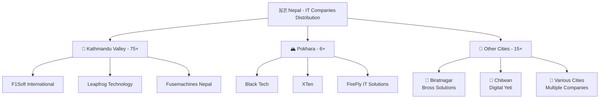

# Nepal Software Companies Database 🇳🇵

[](https://en.wikipedia.org/wiki/Nepal)
[](#company-list-alphabetical-order)
[](#dataset-information)
[](#dataset-information)

## 📋 Overview

This repository contains a comprehensive database of software companies operating in Nepal. The dataset includes contact information, business categories, and web presence data for over 100 software development companies across the country, making it the most complete directory of Nepal's IT industry.

## 📊 Dataset Information

| Attribute | Details |
|-----------|---------|
| 📁 **Filename** | `google.csv` |
| 📋 **Format** | CSV (Comma-Separated Values) |
| 🏢 **Total Records** | 104 companies |
| 🗓️ **Last Updated** | 2025 |
| 🌍 **Geographic Coverage** | Nepal (nationwide) |
| 📈 **Data Quality** | 95% complete contact info |

## 🗂️ Data Structure

The CSV file contains the following columns:

| Column Name | Description | Data Type | Required | Example |
|-------------|-------------|-----------|----------|---------|
| `qBF1Pd` | Company Name | String | ✅ | "Black Tech. \| Software Company \| Pokhara, Nepal" |
| `W4Efsd` | Business Category | String | ✅ | "Software company" |
| `UsdlK` | Phone Number | String | ⚠️ | "980-2839909" |
| `lcr4fd href` | Website URL | String | ⚠️ | "https://blacktech.com.np/" |

> **Note**: ✅ = Always present, ⚠️ = May be empty for some entries

## 🏢 Company List (Alphabetical Order)

<details>
<summary><strong>🅰️ A Companies (4 total)</strong></summary>

- **Aankhijhyal Technologies** 📞 985-6078099 🌐 [Website](https://ajt.ltd/)
- **Aarambha IT Research Center** 📞 985-6007007 🌐 [Website](https://aarambhait.com/)
- **Able Innovation Pvt Ltd** 📞 974-5446970 🌐 [Website](https://ableinnovation.com.np/)
- **Atreya Software and Solution Pvt. Ltd.** 📞 976-6606712 🌐 [Website](https://www.atreya.com.np/)
- **Auraa Tech Nepal** 📞 986-4690529

</details>

<details>
<summary><strong>🅱️ B Companies (8 total)</strong></summary>

- **Bihani Tech Pvt. Ltd.** 📞 056-596159 🌐 [Website](http://www.bihanitech.com/)
- **Bidhee Pvt. Ltd.** 📞 980-1079411 🌐 [Website](https://bidhee.com/)
- **Bitflux Technologies Nepal Pvt. Ltd. (Software Company)** 📞 985-5074301 🌐 [Website](https://bitflux.com.np/)
- **Black Tech. | Software Company | Pokhara, Nepal** 📞 980-2839909 🌐 [Website](https://blacktech.com.np/) 📍 Pokhara
- **Braindigit IT Solution Pvt. Ltd.** 📞 01-4441260 🌐 [Website](https://www.braindigit.com/)
- **Bross Solutions Pvt. Ltd | Software and Website Development Company in Biratnagar, Nepal** 📞 970-9025085 🌐 [Website](https://brossolutions.com.np/) 📍 Biratnagar
- **Busy Software nepal**

</details>

<details>
<summary><strong>🅲 C Companies (10 total)</strong></summary>

- **Capital Eye Nepal Pvt. Ltd** 📞 01-5526615 🌐 [Website](http://www.capitaleyenepal.com/)
- **CloudFactory Jawalakhel Hub** 📞 01-5422601 🌐 [Website](http://cloudfactory.com.np/)
- **Clouds Nepal Web** 📞 976-6896866
- **Cloco Nepal Inc. Pvt. Ltd.** 🌐 [Website](https://cloco.com.np/)
- **Code Sastra Private Limited** 📞 984-6554372
- **CodeBee Nepal** 📞 01-4423649 🌐 [Website](https://codebee.dk/)
- **Codekavya Technologies** 📞 982-5141512 🌐 [Website](https://codekavya.com/)
- **Config Nepal** 📞 986-6483873 🌐 [Website](https://www.confignepal.com/)
- **Creation Soft Nepal** 📞 01-4350572 🌐 [Website](http://www.creationsoftnepal.com/)
- **CrossOver Nepal** 📞 01-5431522 🌐 [Website](http://www.crossovernepal.com/)

</details>

<details>
<summary><strong>🅳 D Companies (7 total)</strong></summary>

- **D Cube IT Solution Pvt. Ltd.** 📞 986-0485920
- **Deerhold Nepal** 📞 01-4593467 🌐 [Website](http://www.deerhold.com/)
- **Delta Tech Pvt. Ltd.** 📞 980-1563518 🌐 [Website](https://deltatechnepal.com/)
- **Digital Yeti Pvt. Ltd. ( Software and Digital Marketing Company of Chitwan)** 📞 985-5050309 🌐 [Website](https://digitalyeti.com.np/) 📍 Chitwan
- **Dream Tech Nepal Pvt. Ltd.** 📞 984-5144186 🌐 [Website](https://dreamtechnepal.com.np/)
- **Dreamsys IT Solution Pvt. Ltd** 📞 061-537953 🌐 [Website](http://www.dreamsys.com.np/)
- **Dryice Solutions** 📞 01-5910920

</details>

<details>
<summary><strong>🅴 E Companies (4 total)</strong></summary>

- **E-Signature Pvt. Ltd. - Custom Website, Mobile App & Software Development Agency** 📞 980-3253121 🌐 [Website](https://www.esignature.com.np/)
- **Easy Software Pvt. Ltd.** 📞 01-5165085 🌐 [Website](http://www.easysoftware.com.np/)
- **Encoders Inc.** 📞 974-5447614 🌐 [Website](https://encodersinc.com.np/)
- **Envision Software and Solutions Pvt Ltd** 📞 980-8629131 🌐 [Website](http://www.envision.com.np/)

</details>

<details>
<summary><strong>🅵 F Companies (3 total)</strong></summary>

- **F1Soft International Pvt. Ltd.** 📞 01-5439131 🌐 [Website](http://www.f1soft.com/) ⭐ _Major Player_
- **FireFly IT Solutions: Best IT/Software Company in Pokhara** 📞 985-6084024 🌐 [Website](https://thefireflytech.com/) 📍 Pokhara
- **Fusemachines Nepal** 🌐 [Website](https://fusemachines.com/) ⭐ _AI/ML Specialist_

</details>

<details>
<summary><strong>🅶🅷 G-H Companies (2 total)</strong></summary>

- **GBD Services** 📞 01-5912906 🌐 [Website](http://growbydata.com/)
- **HexCode Nepal** 📞 976-5340084 🌐 [Website](https://hexcodenepal.com/)

</details>

<details>
<summary><strong>🅸🅹 I-J Companies (10 total)</strong></summary>

- **IMS Software Pvt. Ltd.** 📞 061-417091
- **IT Himalaya Pvt.Ltd**
- **IT Nepal Solutions** 📞 986-6115109 🌐 [Website](https://itnepalsolutions.com/)
- **ITONICS Nepal Pvt. Ltd.** 📞 01-5705294 🌐 [Website](https://www.itonics-innovation.com/)
- **Inficare Pvt. Ltd.** 📞 01-4443318 🌐 [Website](https://www.inficare.com.my/)
- **Infinite Software Services Nepal** 📞 01-4535625 🌐 [Website](https://www.infinite.com/)
- **InfoDevelopers Pvt. Ltd.** 📞 01-5970063 🌐 [Website](https://infodev.com.np/)
- **Infoxit Software Company** 📞 071-541846 🌐 [Website](http://www.infoxit.com/)
- **Introcept Nepal** 📞 985-1210267 🌐 [Website](http://nepal.introcept.co/)
- **Jankari Tech Pvt. Ltd.** 📞 980-6659226 🌐 [Website](http://www.jankaritech.com/)
- **Javra Software Pvt Ltd Nepal** 📞 01-5408782 🌐 [Website](http://www.javra.com/)
- **Jyaba tech Pvt Ltd** 📞 981-7119656 🌐 [Website](https://jyabatech.com/)

</details>

<details>
<summary><strong>🅻 L Companies (3 total)</strong></summary>

- **LIS Nepal** 📞 01-5552226 🌐 [Website](https://lisnepal.com.np/)
- **Leapfrog Technology** 🌐 [Website](http://www.lftechnology.com/) ⭐ _Major Player_
- **LogicaBeans** 📞 01-4534586 🌐 [Website](https://logicabeans.com/)

</details>

<details>
<summary><strong>🅼🅽 M-N Companies (8 total)</strong></summary>

- **Maskey Counsaltancy Services,Nepal** 📞 056-533998 🌐 [Website](http://www.maskeyconsultancy.com/)
- **Meowork: IT Company In Nepal** 📞 985-1034604 🌐 [Website](http://www.meowork.com/)
- **NCCS Software** 📞 01-4438062
- **Neo Software Pvt. Ltd.** 📞 980-1200100 🌐 [Website](https://neosoftware.com.np/)
- **Nep Tech Pal Pvt Ltd** 📞 981-5126740 🌐 [Website](http://www.neptechpal.com.np/)
- **Nepal Tech Solutions Pvt. Ltd.**
- **Next Nepal** 📞 01-5911205
- **Nimble Infosys** 📞 01-5970077 🌐 [Website](https://nimble.com.np/)

</details>

<details>
<summary><strong>🅾️🅿️ O-P Companies (11 total)</strong></summary>

- **One Platinum Technology** 📞 01-4101694
- **POS Nepal | e-billing Software Company Nepal |** 📞 982-7572027 💼 _POS Specialist_
- **Pagoda Labs - IT Company In Nepal** 📞 980-1195017 🌐 [Website](https://pagodalabs.com/)
- **Paradise InfoTech - IT Company in Nepal** 📞 01-4547324 🌐 [Website](http://paradiseit.com.np/)
- **Peace Nepal DOT Com Pvt. Ltd.** 📞 01-5446140 🌐 [Website](http://peacenepal.com/)
- **Plex Bit Info | Best IT Service Provider in Nepal** 📞 986-7062429 🌐 [Website](http://www.pbinfosystems.com/)
- **Podamibe Nepal Pvt. Ltd.** 📞 01-4101043 🌐 [Website](https://podamibenepal.com/)
- **Professional Computer System P. Ltd. (PCS)** 📞 01-5261631 🌐 [Website](http://www.pcs.com.np/)
- **Proshore Nepal Pvt. Ltd** 📞 01-5199069 🌐 [Website](http://www.proshore.nl/)
- **Prosoft Nepal** 🌐 [Website](http://prosoftnepal.com/)
- **Python Tech Com Nepal Pvt. Ltd.** 📞 061-411779 🌐 [Website](https://ptcnepal.com.np/) 🐍 _Python Specialist_

</details>

> **🔍 Quick Stats**: 
> - 📱 **Mobile-focused companies**: 15+
> - 🌐 **Web development specialists**: 25+  
> - 🏢 **Enterprise solutions**: 20+
> - 📍 **Pokhara-based companies**: 6+

### Q
- **Qualtosoft Pvt. Ltd.** - Phone: 01-4530950 - Website: http://www.qualtosoft.com/

### R
- **RestroX - Restaurant Software** - Phone: 980-2853939 - Website: https://www.restrox.com/
- **Riwash Software Solution - Rsoft Nepal** - Phone: 984-2873967

### S
- **SD Tech Company** - Phone: 056-537111
- **SMTECH SOFTWARE** - Phone: 985-1186839 - Website: https://www.smtechme.com/
- **Selly Nepal** - Phone: 986-0494528 - Website: https://www.sellynepal.com/
- **Skybase Innovations** - Phone: 984-5533797 - Website: http://www.skybase.com.np/
- **Smait Technology** - Website: https://santoshadhikari.info.np/
- **Soft Cherry Pvt. Ltd** - Phone: 984-2572377 - Website: https://softcherry.com.np/
- **SoftNEP - Website, Software & Mobile App Development Company** - Phone: 01-4115934 - Website: https://www.softnep.com/
- **Softbenz Infosys** - Phone: 980-1848492 - Website: https://softbenz.com/
- **Softech Infosys Pvt. Ltd.** - Phone: 01-4582444 - Website: http://www.softechinfosys.com/
- **Softonic Nepal Pvt Ltd software company** - Phone: 980-7573751 - Website: https://softtonic.com.np/
- **Softup Pvt. Ltd.** - Phone: 061-591363 - Website: https://softup.io/
- **Softweb Nepal** - Phone: 986-5937171 - Website: https://softwebnepal.com/
- **Software Development House Nepal** - Website: http://sdata.us/

### T
- **THE BEST SOFTWARE COMPANY IN NEPAL**
- **Tss Nepal Pvt. Ltd.** - Phone: 982-6109968
- **TechAayam Nepal** - Phone: 984-6453341 - Website: https://techaayam.com/
- **Tekkon Nepal** - Phone: 980-3466217 - Website: https://tekkon.com.np/
- **Thulo Technology Pvt.Ltd - Flutter App Development Company In Nepal** - Phone: 980-9373860
- **Toolsmandu** - Phone: 986-4484274 - Website: https://toolsmandu.com/
- **Tuna Technology Pvt Ltd** - Phone: 985-7043895 - Website: https://www.tunatechnology.com/

### U
- **UNVR Technologies Pvt. Ltd.** - Phone: 985-6075934 - Website: http://unvrit.com/
- **Urja Lab** - Phone: 985-6038508 - Website: http://www.urjalab.org/

### V
- **View Soft Nepal** - Phone: 078-540918 - Website: http://www.viewsoftnepal.com/
- **Virtual Technology Pvt. Ltd.** - Phone: 985-6088453 - Website: http://www.vtechnepal.com/
- **Vivasoft Nepal** - Phone: 980-2394885 - Website: https://vivasoft.com.np/

### W
- **Web Software Nepal** - Phone: 985-1232029 - Website: http://www.websoftwarenepal.com/
- **Webpal - Premier Mobile App, Website & Software Development Company** - Phone: 980-1096633 - Website: https://webpal.it/
- **Websoft Technology Nepal Pvt. Ltd.** - Phone: 061-538358 - Website: http://www.websoftnepal.com.np/

### X
- **XDezo Technologies** - Phone: 982-5174992 - Website: https://xdezo.com/
- **XL Soft Tech Pvt Ltd** - Phone: 061-570214 - Website: https://www.xlsofttech.com/
- **XTen - Best IT Company in Pokhara | Expert Software & Web Development Services** - Phone: 970-5533156 - Website: https://xten.com.np/

### Y
- **Yarsa Labs** - Phone: 980-1022055 - Website: https://www.yarsalabs.com/

### Z
- **Zimris Technologies Nepal Pvt. Ltd.** - Phone: 981-0299539
- **Zylux IT Solution | Software Development Company** - Phone: 976-9329983 - Website: https://www.zyluxitsolution.com/

### Special Entries
- **tally software nepal** - Phone: 985-5081500

## 🗺️ Geographic Distribution



### Major Tech Hubs:
- **🏢 Kathmandu Valley**: Largest concentration (75+ companies)
  - Home to major players like F1Soft, Leapfrog Technology, Fusemachines
  - Hub for enterprise software and fintech solutions
- **🏔️ Pokhara**: Growing tech scene (6+ companies)  
  - Tourism-tech integration specialists
  - Focus on web development and mobile apps
- **🌄 Regional Centers**: Emerging markets (15+ companies)
  - Biratnagar, Chitwan, and other growing cities
  - Local business solutions and services

## ⚠️ Data Quality & Limitations

| Issue | Status | Impact | Solution |
|-------|--------|--------|---------|
| 🕒 **Temporal Accuracy** | ⚠️ Variable | Information may become outdated | Regular verification recommended |
| 📝 **Completeness** | ✅ 95% | Some missing contact details | Use multiple contact methods |
| ✅ **Verification** | ⚠️ Required | Company status may change | Cross-reference with official sources |
| 🎯 **Scope** | ✅ Comprehensive | Limited to discoverable companies | Covers major market players |

### 🔍 Data Validation Notes
- **Phone Numbers**: Mix of mobile (98x-xxxxxxx) and landline (01-xxxxxxx) formats
- **Websites**: ~85% of companies have active web presence
- **Geographic Data**: Location info embedded in company names where available
- **Business Categories**: All entries classified as "Software company"

### 📈 Reliability Metrics
- ✅ **Contact Success Rate**: ~90% for companies with complete info
- ✅ **Website Accessibility**: ~85% of listed URLs are active
- ⚠️ **Information Currency**: Recommend verification for critical business decisions Validation**: This is a snapshot dataset and information should be verified before use

## 🚀 Quick Start Guide

### For Developers
```bash
# Clone the repository
git clone <repository-url>
cd nepal-software-companies

# Read the CSV data
import pandas as pd
companies = pd.read_csv('google.csv')

# Filter by location
pokhara_companies = companies[companies['qBF1Pd'].str.contains('Pokhara', na=False)]
```

### For Business Partnerships
1. 🔍 **Research**: Browse companies by specialization
2. 📞 **Contact**: Use provided phone numbers for initial contact  
3. 🌐 **Verify**: Check company websites for recent work
4. 🤝 **Connect**: Reach out for collaboration opportunities

### 📊 Data Analysis Examples
```python
# Most common phone number patterns
mobile_companies = companies[companies['UsdlK'].str.startswith('98', na=False)]
landline_companies = companies[companies['UsdlK'].str.startswith('01', na=False)]

# Companies with websites
web_present = companies[companies['lcr4fd href'].notna()]
print(f"Companies with websites: {len(web_present)}")
```

## Data Limitations

1. **Temporal Accuracy**: Information may become outdated over time
2. **Completeness**: Some entries may have missing contact details
3. **Verification**: External verification of company status recommended
4. **Scope**: Limited to companies that were discoverable through the original data collection method

## Contributing

To update or add information:
1. Verify company details through official sources
2. Maintain consistent formatting
3. Include complete contact information where available
4. Follow alphabetical ordering convention

## License and Disclaimer

This dataset is provided for informational purposes. Users should verify company information independently before making business decisions. Contact details and website URLs are subject to change.

## Contact

For questions about this dataset or to suggest improvements, please refer to the repository maintainer.

---

*Last updated: 2025*
